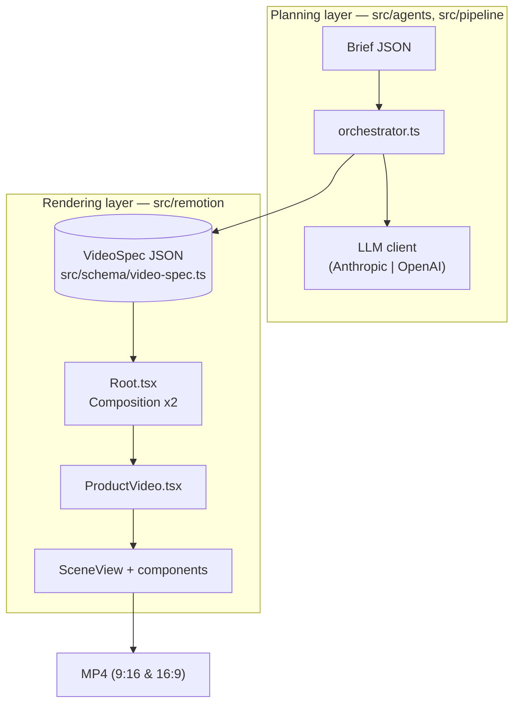
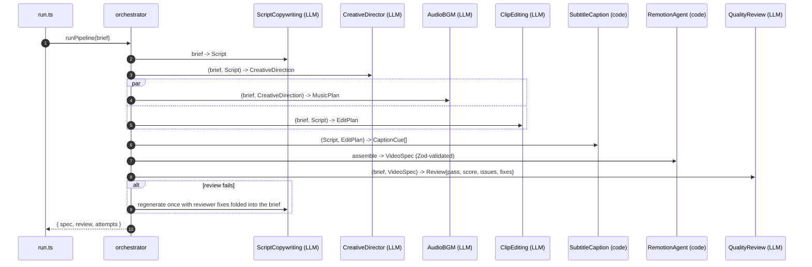

# Architecture — remotion-video-pipeline

Companion to [README.md](README.md). Describes the system design, the `VideoSpec`
contract, the agent pipeline, the Remotion rendering layer, and operational concerns.

## 1. System overview

Two decoupled layers communicate through a single Zod-validated artifact, the
**`VideoSpec`**:



**Key property:** the rendering layer never imports the agents or the LLM client.
You can render from any `VideoSpec` JSON with no network access and no API key.

## 2. The VideoSpec contract

Defined in [src/schema/video-spec.ts](src/schema/video-spec.ts). It is the only
coupling point between planning and rendering, which makes each side independently
testable and replaceable.

- `title`, `callToAction`
- `brand`: `{ name, primary, secondary, background, text, fontFamily, logoSrc }`
- `fps`
- `scenes[]`: `{ id, type, durationInSeconds, headline, subtext?, bullets[], footageSrc, backgroundColor?, transition }`
- `captions`: `{ enabled, vttSrc, cues[] }` where a cue is `{ startMs, endMs, text }`
- `music`: `{ mood, trackSrc, volume }`

Remotion consumes it directly: each `<Composition>` declares `schema={videoSpecSchema}`,
so Remotion Studio renders an editable form and validates props at render time.
`calculateMetadata` derives `durationInFrames` from the sum of scene durations.

## 3. Planning pipeline

Orchestrated by [src/pipeline/orchestrator.ts](src/pipeline/orchestrator.ts).



**LLM client** ([src/agents/llm/client.ts](src/agents/llm/client.ts)):
- Selects provider from `LLM_PROVIDER`; reads the key from the environment (never hard-coded).
- `generateJSON({ system, user, schema })` extracts JSON from the reply, validates it with the
  agent's Zod schema, and on failure retries with the validation error appended to the prompt.
- Throws `MissingApiKeyError` with actionable text when no key is present.

**Why some agents are deterministic:** caption timing and final assembly are exact,
mechanical transforms. Implementing them as code (not prompts) removes a class of
LLM failure modes and makes them unit-testable. They remain modeled as `Agent`s so
they can be swapped for LLM implementations later without touching the orchestrator.

## 4. Rendering layer

- [Root.tsx](src/remotion/Root.tsx) registers two `<Composition>`s that differ only in
  `width`/`height` (from [config/pipeline.config.ts](config/pipeline.config.ts)).
- [ProductVideo.tsx](src/remotion/compositions/ProductVideo.tsx) places each scene on the
  timeline via `<Sequence>`, overlays timed captions, and plays music across the whole video.
- [SceneView.tsx](src/remotion/scenes/SceneView.tsx) renders one scene with a spring-based
  enter + fade-out and its `transition` (fade/slide/zoom/none). Type sizes scale off
  `min(width, height)` so the same component looks right in both orientations.
- Components: `Background` (footage or animated gradient), `Captions`, `BrandLogo`
  (image or wordmark), `MusicTrack` (silent until a track is supplied).

## 5. Data flow & lineage

`Brief → Script → {CreativeDirection, MusicPlan, EditPlan} → CaptionCue[] → VideoSpec → MP4`.
Captions can alternatively originate from an external `.vtt` (the Bee Naturals subtitle
pipeline) via `npm run prep:captions`, which parses the file with
[src/captions/vtt.ts](src/captions/vtt.ts) and inlines cues into the spec.

## 6. Dependencies

| Dependency | Role |
|---|---|
| `remotion`, `@remotion/cli` | rendering engine + Studio/CLI |
| `@remotion/google-fonts`, `@remotion/zod-types` | fonts; `zColor` for schema-driven color controls |
| `zod` | the `VideoSpec` contract + all agent I/O validation |
| `@anthropic-ai/sdk`, `openai` | interchangeable LLM providers |
| `commander`, `dotenv` | CLI + env loading |
| `tsx` | run the TypeScript CLIs without a build step |

## 7. Security considerations

| Area | Note |
|---|---|
| API keys | Read only from env (`.env` is git-ignored). Never logged or committed. |
| Copyrighted media | `.gitignore` excludes `*.mp3/*.wav/*.mp4/*.mov`; only sample `.vtt` and JSON are committed. |
| LLM output | Never `eval`'d — only parsed as JSON and validated by Zod before use. |
| Prompt-injection surface | Briefs are operator-authored today; treat any third-party brief text as untrusted input. |
| Renders | Remotion runs headless Chromium locally; no spec data leaves the machine during rendering. |

## 8. Scalability & extension

- **Batch:** wrap `runPipeline` in a queue worker to process many briefs concurrently; specs and renders are independent and parallelizable.
- **Rendering at scale:** use `@remotion/renderer` programmatically or Remotion Lambda for horizontal, serverless renders.
- **New formats:** add a `<Composition>` (e.g. 1:1) — scenes already adapt responsively.
- **Richer transitions:** adopt `@remotion/transitions` inside `ProductVideo`.
- **Caching:** memoize agent outputs by a hash of the brief to avoid re-spending tokens.

## 9. Testing

Deterministic units are covered by Vitest (no API key required):
- `tests/vtt.test.ts` — timestamp parsing, cue extraction, active-cue lookup.
- `tests/video-spec.test.ts` — schema defaults, sample-spec validity, duration math.
- `tests/assembler.test.ts` — caption timing + duration normalization in `assembleVideoSpec`.

CI runs on Node 20:
- [.github/workflows/ci.yml](.github/workflows/ci.yml) — typecheck + lint + tests (fast; no browser).
- [.github/workflows/preview.yml](.github/workflows/preview.yml) — renders a half-scale 9:16 preview MP4 on every push and uploads it as an artifact (see §10).

## 10. Rendering a custom spec & CI preview

**Custom spec (local):** the renderer reads a `VideoSpec` from Remotion's `--props`, so any
spec (e.g. from `npm run plan`) can be rendered without code changes:

```bash
npm run render:vertical -- --props=data/specs/generated.video-spec.json
```

Remotion merges `--props` over the composition's `defaultProps` and validates the result with
`videoSpecSchema`; `calculateMetadata` then recomputes the duration from the supplied scenes.

**CI preview:** [preview.yml](.github/workflows/preview.yml) runs on every push. On `ubuntu-22.04`
it installs Chromium's system libraries, runs `npx remotion browser ensure`, renders
`npm run preview` (9:16 at half scale → `out/preview.mp4`), and uploads it as the
`preview-vertical-mp4` artifact. Rendering is kept in a separate workflow from `ci.yml` so the
fast checks aren't blocked by the slower render.
