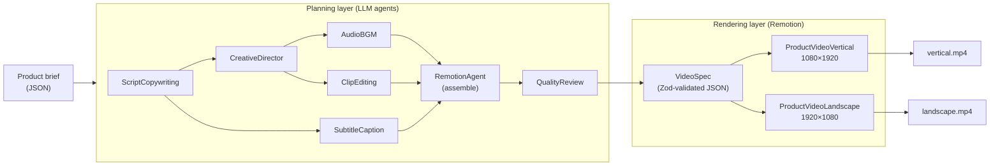

# remotion-video-pipeline


An AI-driven programmatic-video pipeline for **Bee Naturals**. A 7-agent planning
layer (LLM) turns a short **product brief** into a validated **VideoSpec**, which
[Remotion](https://www.remotion.dev/) renders to social-ready MP4s in **both 9:16
(reels) and 16:9 (landscape)** — with animated scenes, timed captions, and a
background-music slot.

> **Two layers, one contract.**
> The **planning layer** (agents + LLM) *writes* a `VideoSpec`. The **rendering
> layer** (Remotion) *reads* a `VideoSpec`. They only ever talk through that
> Zod-validated JSON — so you can render without ever calling an LLM.

---

## Table of Contents
- [Highlights](#highlights)
- [How it works](#how-it-works)
- [The 7 agents](#the-7-agents)
- [Tech stack](#tech-stack)
- [Prerequisites](#prerequisites)
- [Installation](#installation)
- [Environment variables](#environment-variables)
- [Usage](#usage)
- [Project structure](#project-structure)
- [Using your real Bee Naturals assets](#using-your-real-bee-naturals-assets)
- [Example input / output](#example-input--output)
- [Troubleshooting](#troubleshooting)
- [Roadmap](#roadmap)
- [License](#license)

## Highlights

- **Render with zero setup.** A committed sample `VideoSpec` renders immediately — **no API key, no media assets required**.
- **Full LLM integration, provider-agnostic.** Anthropic **or** OpenAI, selected by env. Every agent output is coerced to JSON and **validated with Zod**, with an automatic repair-retry.
- **Both orientations from one codebase.** `ProductVideoVertical` (1080×1920) and `ProductVideoLandscape` (1920×1080) share the same responsive scenes.
- **Timed captions** parsed from your existing `.vtt` files (the output of the Bee Naturals subtitle scripts) or generated from the script.
- **Royalty-free music slot** — drop a licensed track in `public/audio`; nothing copyrighted is ever committed.
- **Typed, tested, CI-ready** — strict TypeScript, Vitest unit tests, ESLint, and a GitHub Actions workflow.

## How it works



- **`npm run plan`** runs the agents and writes a fresh `VideoSpec` (needs an API key).
- **`npm run studio` / `npm run render`** read a `VideoSpec` and preview/render it (no API key).

## The 7 agents

| Agent | Type | Responsibility |
|---|---|---|
| `ScriptCopywritingAgent` | LLM | Brief → script (hook, per-beat narration + on-screen text, CTA) |
| `CreativeDirectorAgent` | LLM | Palette, typography, mood, pacing, per-beat visual + transition |
| `AudioBGMAgent` | LLM | Royalty-free music *brief* (mood, BPM, mix volume) — no audio is generated |
| `ClipEditingAgent` | LLM | Allocates each scene's duration + footage hint |
| `SubtitleCaptionAgent` | deterministic | Times captions from narration across scene durations |
| `RemotionAgent` | deterministic | Assembles everything into one Zod-validated `VideoSpec` |
| `QualityReviewAgent` | LLM | Brand/compliance gate; scores 0–100 and can trigger one regenerate |

Mechanical steps (caption timing, final assembly) are deterministic code by
design; the subjective steps use the LLM. See [ARCHITECTURE.md](ARCHITECTURE.md).

## Tech stack

- **Remotion 4** (React 18 + TypeScript) — programmatic video
- **Zod** — the `VideoSpec` contract + all agent I/O validation
- **Anthropic SDK / OpenAI SDK** — pluggable LLM providers
- **Commander** — CLI • **dotenv** — config • **Vitest** — tests • **ESLint + Prettier**

## Prerequisites

- **Node.js ≥ 20** (developed on Node 24)
- A **Chromium** download happens automatically on first render (Remotion manages it)
- *(Optional)* an **Anthropic or OpenAI API key** — only to run the planning layer

## Installation

```powershell
git clone git@github.com:vpress000/remotion-video-pipeline.git
cd remotion-video-pipeline
npm install
cp .env.example .env   # optional; only needed for `npm run plan`
```

> **Windows/PowerShell note:** if `npm` is blocked by execution policy, call `npm.cmd`
> (e.g. `npm.cmd install`) or run in Command Prompt.

## Environment variables

Copy `.env.example` → `.env`. **All are optional for rendering**; a key is only
required for `npm run plan`.

| Variable | Purpose | Default |
|---|---|---|
| `LLM_PROVIDER` | `anthropic` or `openai` | `anthropic` |
| `ANTHROPIC_API_KEY` | Key for Anthropic | — |
| `ANTHROPIC_MODEL` | Anthropic model | `claude-3-5-sonnet-latest` |
| `OPENAI_API_KEY` | Key for OpenAI | — |
| `OPENAI_MODEL` | OpenAI model | `gpt-4o` |
| `BN_CAPTIONS_DIR` | Folder of your `.vtt` files | Bee Naturals VTT path |
| `BN_FOOTAGE_DIR` | Folder of product clips | Bee Naturals footage path |
| `BN_AUDIO_DIR` | Music folder | `public/audio` |

## Usage

**Preview in Remotion Studio (no key needed):**
```powershell
npm run studio
```

**Render MP4s (no key needed — uses the sample spec):**
```powershell
npm run render            # both orientations -> out/vertical.mp4, out/landscape.mp4
npm run render:vertical   # just 9:16
npm run render:landscape  # just 16:9
npm run preview           # fast half-scale 9:16 preview -> out/preview.mp4
npm run still             # single validation frame -> out/still.png
```

**Render a custom spec** (e.g. one produced by `npm run plan`) — pass it with Remotion's `--props`:
```powershell
npm run render:vertical -- --props=data/specs/generated.video-spec.json
npm run render:landscape -- --props=data/specs/generated.video-spec.json
```
Remotion loads the JSON as input props and validates it against the schema.

**Generate a fresh spec from a brief (needs an API key):**
```powershell
# 1) put a key in .env, then:
npm run plan -- --brief data/briefs/sample-product.json --out data/specs/generated.video-spec.json
# 2) render it with --props:
npm run render:vertical -- --props=data/specs/generated.video-spec.json
```

**Inline external captions into a spec:**
```powershell
# set "captions.vttSrc" in a spec to a .vtt filename, then:
npm run prep:captions -- --spec data/specs/sample.video-spec.json
```

**Quality gates:**
```powershell
npm run typecheck && npm run lint && npm test
```

## Project structure

```
remotion-video-pipeline/
├── config/pipeline.config.ts        # asset paths + render dimensions (env-overridable)
├── data/
│   ├── briefs/sample-product.json   # example input brief
│   └── specs/sample.video-spec.json # committed spec (renders with no key/assets)
├── assets/captions/sample.vtt       # example transcript for the caption step
├── public/                          # Remotion static assets (git-ignored media)
│   ├── audio/  footage/  brand/     # drop your royalty-free music / clips / logo here
├── src/
│   ├── schema/video-spec.ts         # the VideoSpec + Brief Zod contracts
│   ├── agents/                      # 7 agents, contracts, and the LLM client
│   │   └── llm/client.ts            # provider-agnostic, env-driven, JSON+Zod validated
│   ├── pipeline/                    # orchestrator + CLIs (plan, prep:captions)
│   ├── captions/vtt.ts              # WebVTT parser
│   └── remotion/                    # Root, compositions, scenes, components, theme
└── tests/                           # Vitest unit tests
```

## Using your real Bee Naturals assets

1. **Captions:** point `BN_CAPTIONS_DIR` at `…\Video Work\Subtitles\VTT Files`, set a spec's `captions.vttSrc` to a `.vtt` filename, and run `npm run prep:captions`.
2. **Footage:** copy clips into `public/footage`, then set a scene's `footageSrc` to the filename.
3. **Music:** drop a licensed track into `public/audio` and set `music.trackSrc` + `music.volume`.
4. **Logo:** drop `logo.png` into `public/brand` and set `brand.logoSrc`.

## Example input / output

**Input** — `data/briefs/sample-product.json`:
```json
{
  "productName": "Vitamin C Facial Nectar",
  "keyIngredients": ["Ferulic acid", "Niacinamide", "Hyaluronic acid"],
  "benefits": ["Brightens dull skin", "Hydrates and smooths"],
  "targetDurationSeconds": 20
}
```

**Output** — a `VideoSpec` (see `data/specs/sample.video-spec.json`) with `scenes[]`,
timed `captions.cues[]`, `brand` theme, and a `music` plan — rendered to
`out/vertical.mp4` and `out/landscape.mp4`.

## Troubleshooting

| Symptom | Fix |
|---|---|
| `npm ... cannot be loaded because running scripts is disabled` (PowerShell) | Use `npm.cmd` / `npx.cmd`, or run in Command Prompt. |
| `No LLM API key configured` on `npm run plan` | Add `ANTHROPIC_API_KEY` or `OPENAI_API_KEY` to `.env`. Rendering does **not** need this. |
| First render is slow | Remotion is downloading Chromium once; subsequent renders are fast. |
| Captions don't show | Ensure the spec has `captions.enabled: true` and non-empty `cues` (run `npm run prep:captions`). |
| Colors rejected by Zod | `brand.*` colors must be valid CSS colors (hex like `#0E1B12`). |

## Continuous integration

- **`ci.yml`** — typecheck, lint, and unit tests on every push/PR.
- **`preview.yml`** — renders a half-scale 9:16 preview MP4 on every push and uploads it as a downloadable **build artifact** (`preview-vertical-mp4`), available from the workflow run's *Artifacts* section.

## Roadmap

- Optional LLM caption rewriting in `SubtitleCaptionAgent`.
- `@remotion/transitions` for richer scene transitions.
- Batch mode: many briefs → many renders via a queue.
- Cache the Remotion browser in CI to speed up preview renders.

## License

Proprietary — © Bee Naturals. Private repository; not licensed for redistribution.
